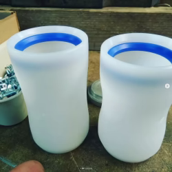
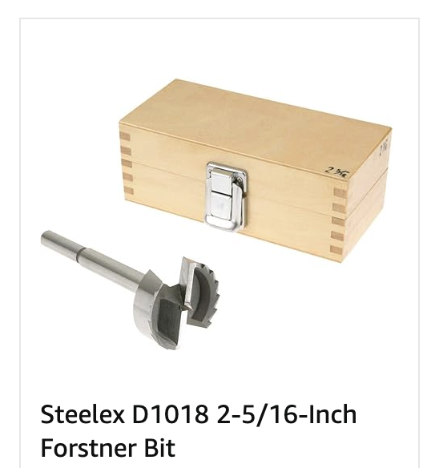

# Mallet Head

## Media

        
  <blockquote class="instagram-media" 
    data-instgrm-permalink="https://www.instagram.com/reel/DIN23ZpupiH/?igsh=MzFoeWlpcm15cG1o" 
    data-instgrm-version="14" 
    style="max-width:540px; margin:auto; text-align: center;">
    <a href="https://www.instagram.com/reel/DIN23ZpupiH/?igsh=MzFoeWlpcm15cG1o" target="_blank">View this post on Instagram</a>
  </blockquote>
  
</div

## Material

[Ultra-high-molecular-weight polyethylene (UHMWPE, UHMW)](https://en.wikipedia.org/wiki/Ultra-high-molecular-weight_polyethylene)

## Size

{width="300"}

[Purchasbale Reference, Heckler's alley webpage](https://hecklersalley.com/collections/bike-polo-heads/products/simone-105a)

- Made of UHMW-PE
- Weighs 74 grams
- ~4.1" (105mm) long
- 2.5" (65mm) outer diameter
- 2.3" (59mm) inner diameter

## Tools

Forstner Bit 

- [2 5/16 inch, Amazon](https://www.amazon.com/gp/product/B0000DD1LI/ref=ox_sc_saved_image_7?smid=&psc=1)

{width="300"}