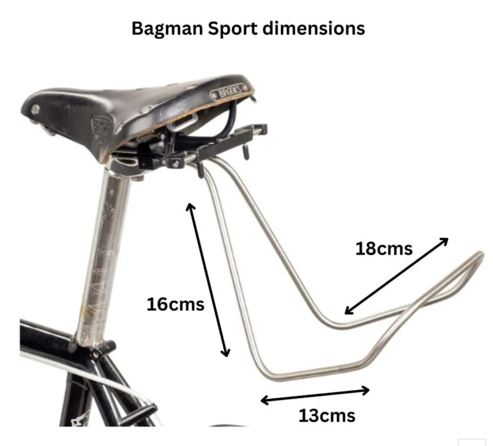
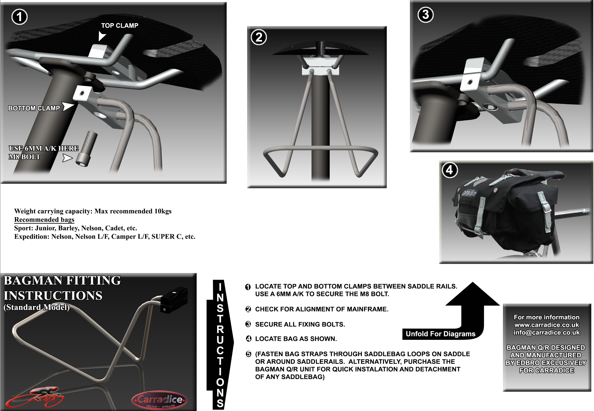

# Front Rack

[Saddle bag front rack](https://analogcycles.com/products/carradice-saddle-bag-support)

- Brand: Carradice
- Cost: $85

{width="300"}

[Saddle bag front rack dimensions](https://carradice.co.uk/products/bagman-sport-saddlebag-support-rack)

- Bagman Sport Saddlebag Support Rack
- $60 standard
- $120 quick release
- Size: 13x16x18 cm

{width="300"}

## Tools

[Wire bender](https://micromark.com/products/vise-mounted-wire-bender?keyword=Wire%20BENDER)
[Wire bender tutorial](https://www.youtube.com/watch?v=3QzrwPx9fNs)

