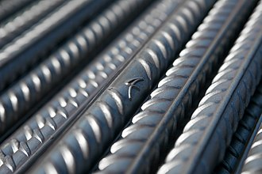
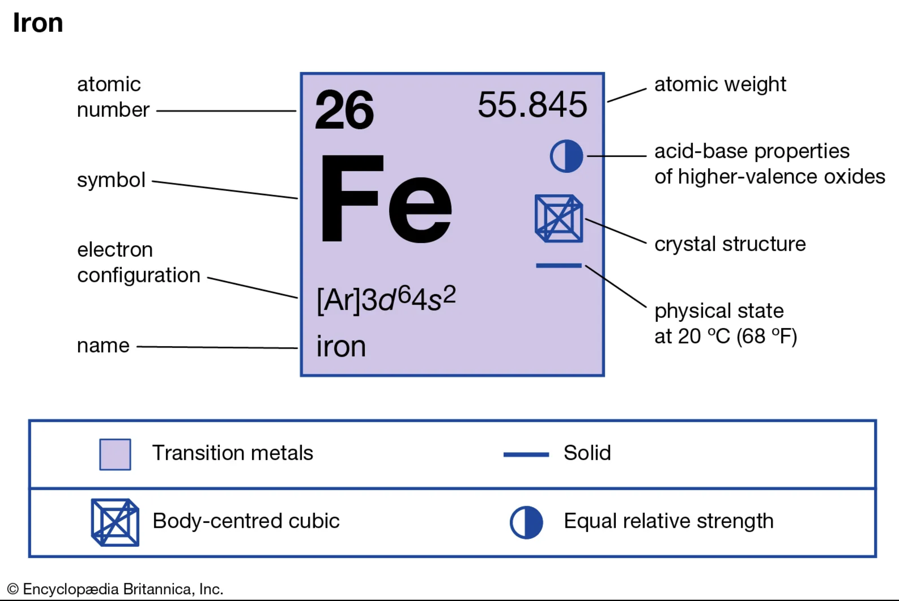
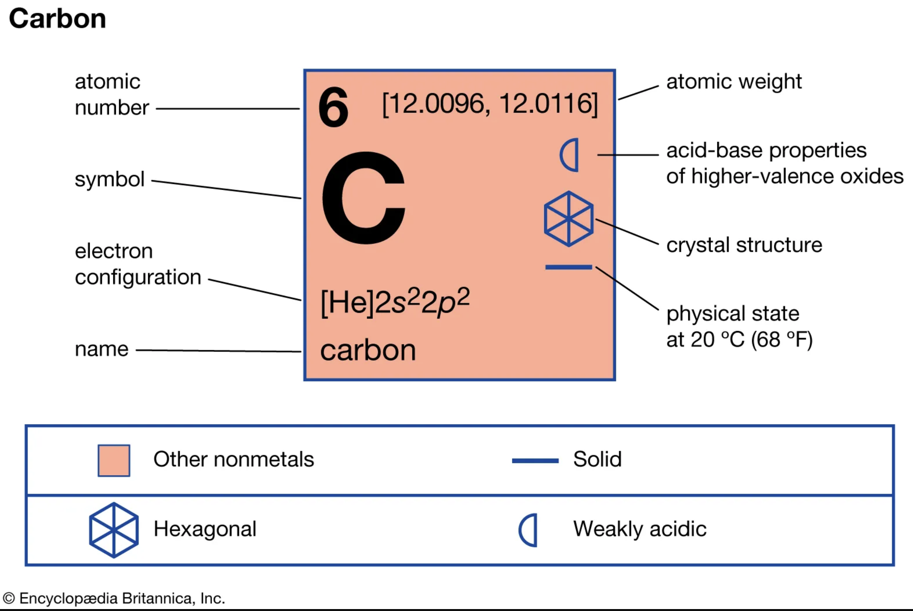

# Steel

{width="400"}

- an alloy of iron and carbon
- high elastic modulus, yield strength, fracture strength
- carbon content of steel is between 0.02% and 2.14% by weight

{width="400"}

{width="400"}

The ductility and elongation of the pure iron state decrease upon the addition of carbon

## Cast Iron

- higher than 2.1% carbon content are known as cast iron
- Cast iron is not malleable even when hot
- can be formed by casting as it has a lower melting point than steel 
- 
 
 
## Wrought iron

- iron alloy with a very low carbon content (less than 0.05%) 

## Carbon Steel (mild steel)

- carbon content from about 0.05 up to 2.1 percent by weight.

Mild Steel

- contains approximately 0.05–0.30% carbon
    - most common form of steel because its price is relatively low while it provides material properties that are acceptable for many applications
    - making it malleable and ductile
    - relatively low tensile strength, but it is cheap and easy to form
- surface hardness can be increased with carburization
- the density of mild steel is approximately 7.85 g/cm3 (7,850 kg/m3; 0.284 lb/cu in)
- the Young's modulus is 200 GPa (29×106 psi)

## Stainless steels

- typically contain 18% chromium 
- exhibit improved corrosion and oxidation resistance 

## Alloys

Common alloying elements include: 

- manganese
- nickel
- chromium
- molybdenum
- boron
- titanium
- vanadium
- tungsten
- cobalt
- niobium

Additional elements, most frequently considered undesirable:

- phosphorus
- sulphur
- silicon
- traces of oxygen, nitrogen, and copper

## Citations

- https://en.wikipedia.org/wiki/Steel