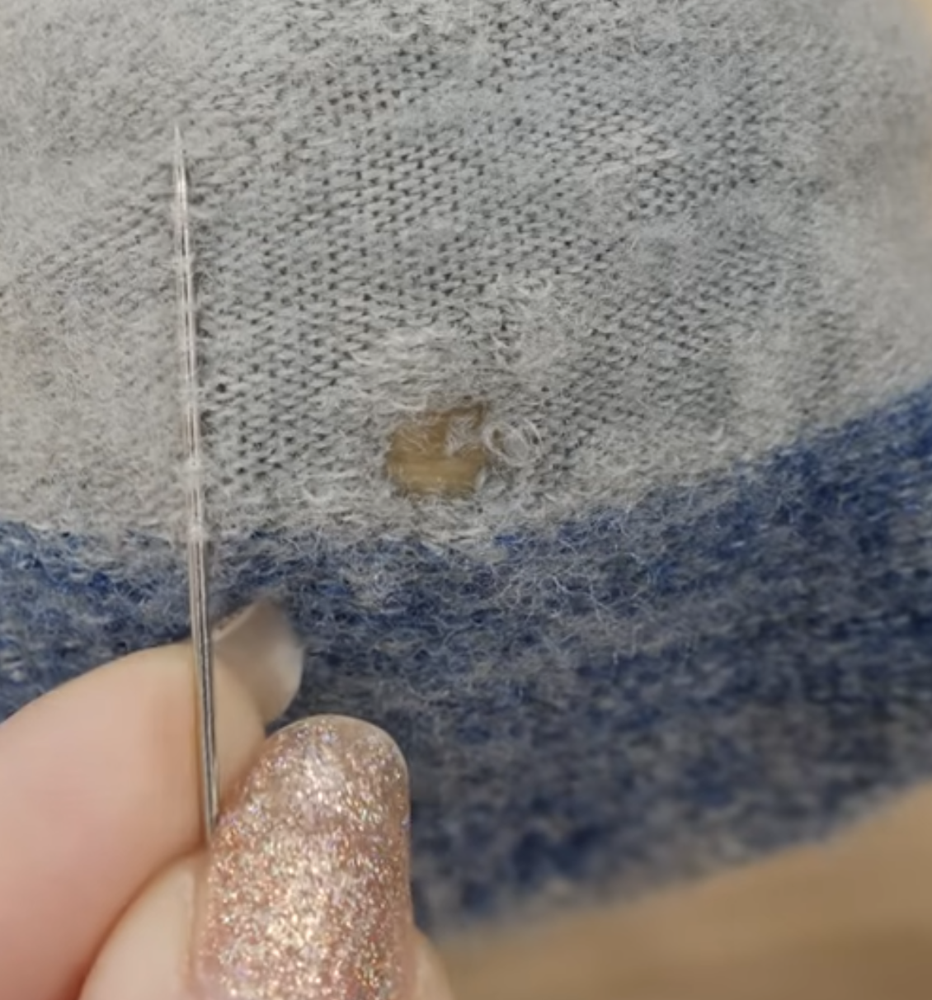
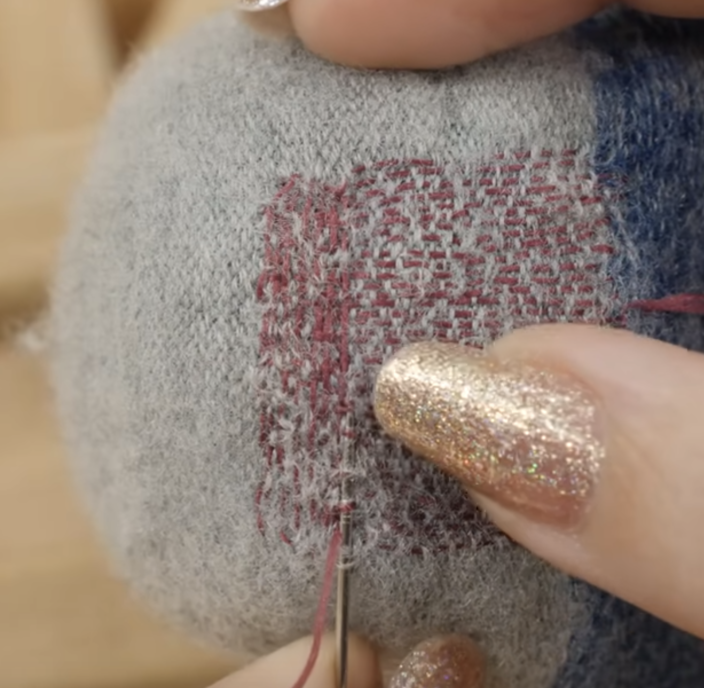

# Patches

## Sock Patching

- [ytb - How to Repair a Hole in a Sock with Darning - 5min](https://www.youtube.com/watch?v=yi_J8YeQkww)

Materials

- Damaged sock... obvi
- Darning Egg or Ball (wooden backing to go inside sock)
- Textured overlock thread or thin yarn
- long needle

Or, you just really need any thread and needle and it should work

Steps:

- Insert darning egg
- Cut out loose fibers
- Then do running stitches covering the entire hole
- And then cross over w/ running stiches perpendicular to above
- Just cut the thread, don't tie ends, will just break...

